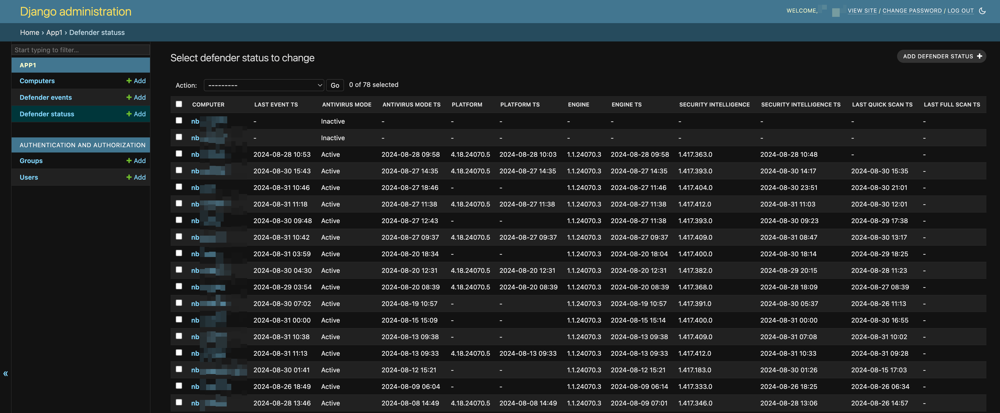

# JankRMM

This is a poor man's RMM and Windows Defender information console.  If something is found wrong with Defender, Django sends an email.

The way I have this working is two PowerShell scripts and the Django app. One script runs every 5 minutes for Defender information and the other runs once a week for the "RMM" functionality.  The scripts are deployed to workstations using a GPO.

# Screenshot

# Install

1. Download the Django app, get it setup using a URL accessible to your workstations.
1. Install the PowerShell scripts (under extras in the repo) on the workstations.

